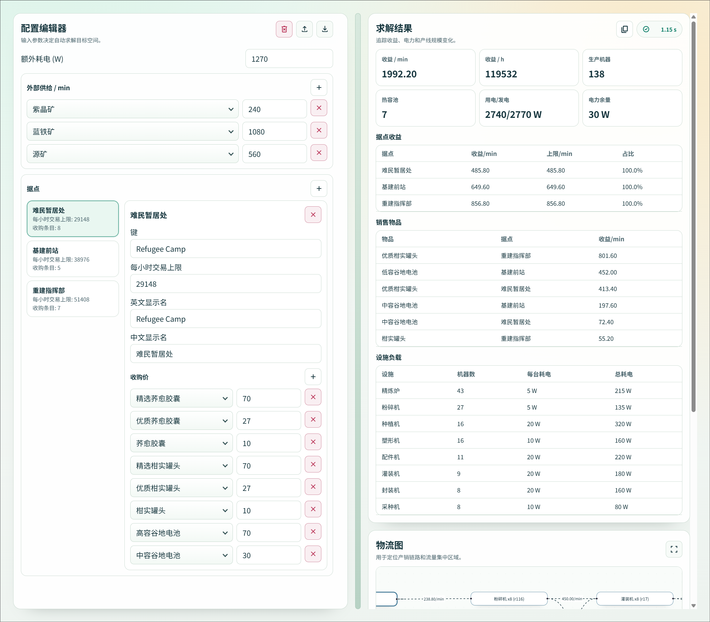

# end-cli

[``end-cli``](https://f47039b0.end-8jk.pages.dev/) 是一个用于《明日方舟：终末地》自动化生产规划的网页、命令行求解器。
给定外部供给（矿点）、据点收购价和预算池、基地内外的额外耗电，可计算:

- 每分钟该跑哪些配方（以及跑多少）
- 各类生产机器需要多少台
- 热容池该喂哪种电池、要开几台
- 卖给哪个据点哪些货，收益最高



## 安装 CLI 版本

### 方式一：下载 GitHub Releases 二进制文件

在 [GitHub Releases](https://github.com/sssxks/end-cli/releases) 页面下载对应平台的压缩包。解压后将 `end-cli` 可执行文件所在目录添加到系统 PATH 中即可。

### 方式二：cargo install

需要 Rust 环境，执行:

```bash
# 编译 HiGHS 需要 clang 和 cmake，Debian/Ubuntu 可用以下命令安装
sudo apt-get update && sudo apt-get install -y libclang-dev clang cmake
cargo install --git https://github.com/sssxks/end-cli end-cli
```

## 快速开始

1. 生成配置模板，这是程序的输入数据文件:

```bash
end-cli init
```

2. 编辑当前目录下的 `aic.toml`（外部供给、外部消耗、据点价格、据点上限、外部耗电）。

3. 运行求解:

```bash
end-cli solve
```

默认输出中文报告。英文报告可用:

```bash
end-cli solve --lang en
```

如果你看到下面这条报错:

```text
Error: aic.toml not found; run `end-cli init --aic aic.toml` to create it
```

它表示当前目录没有对应配置文件，`solve` 会直接拒绝执行。先运行 `end-cli init` 生成模板并按需修改后再求解。

## `aic.toml` 关键字段

`end-cli init` 生成的模板大致如下:

```toml
external_power_consumption_w = 300

[supply_per_min]
"Originium Ore" = 520
"Ferrium Ore" = 160
"Amethyst Ore" = 160

[external_consumption_per_min]
"Originium Ore" = 20

[[outposts]]
key = "Refugee Camp"
money_cap_per_hour = 17316
[outposts.prices]
"SC Valley Battery" = 30
Origocrust = 1
```

可重点调整:

- `external_power_consumption_w`: 非生产机器占用的额外电力
- `supply_per_min`: 每种原料的每分钟外部供给
- `external_consumption_per_min`: 场景每分钟的固定外部消耗（例如被任务从仓库提取）
- `outposts[].money_cap_per_hour`: 据点每小时交易额上限
- `outposts[].prices`: 各商品在该据点的收购价

## 常用命令

```bash
# 初始化配置（覆盖已存在文件）
end-cli init --force

# 用指定配置文件求解
end-cli solve --aic aic.toml

# 指定语言
end-cli solve --lang en

# 指定数据目录（items/facilities/recipes）
end-cli solve --data-dir ./data

# 查看帮助
end-cli --help
end-cli init --help
end-cli solve --help
```

## 它到底在优化什么

程序使用两阶段 MILP（混合整数线性规划）模型，详细公式见 [model_v1.md](docs/blogs/model_v1.md):

1. Stage 1: 最大化每分钟总收入
2. Stage 2: 在 Stage 1 的最优收入附近，最小化机器总数（生产机器 + 热容池）

核心约束包括:

- 物料守恒（含热容池燃料消耗）
- 据点每小时交易额上限
- 配方吞吐受机器数量约束
- 总发电功率 >= 总用电功率

## Web

仍在开发。

```bash
# 仓库根目录：先构建并同步 wasm 到 web/public/wasm
bash scripts/build_web_wasm.sh

# 启动前端
cd web
npm install
npm run dev
```
