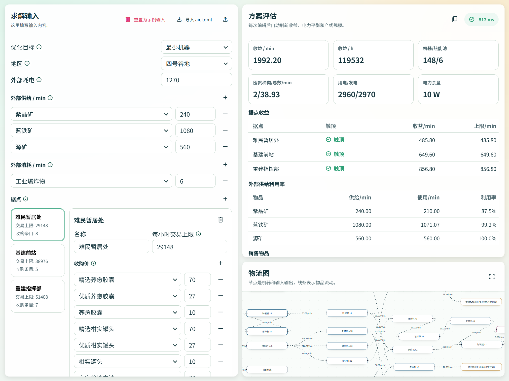
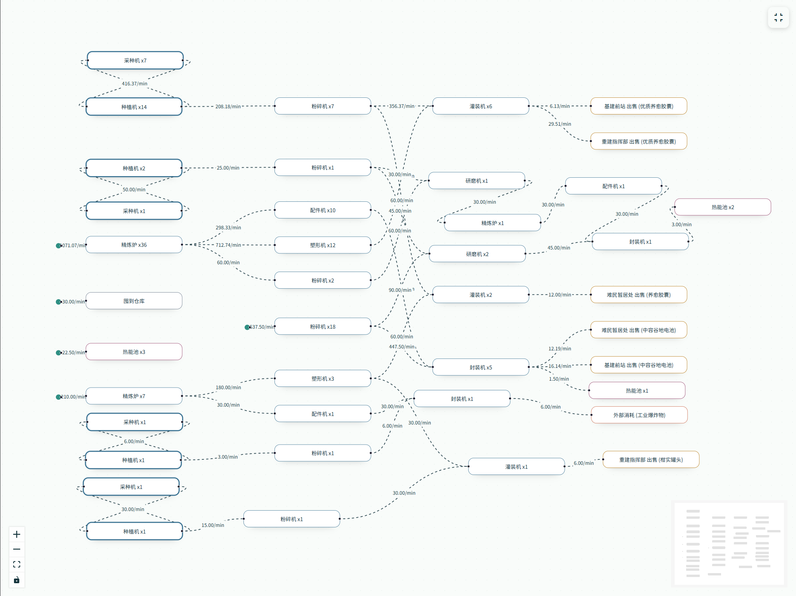

<!-- markdownlint-disable -->

<div align="center">

 <br>

<!-- markdownlint-restore -->

# 源石计划

[](https://github.com/sssxks/end-cli/actions/workflows/ci.yml)

终末地产线规划

使用 Rust / WebAssembly 实现的终末地生产线规划工具，支持 CLI 和 Web 版本。基于 HiGHS 求解器实现 MILP 模型求解。

🔗 网页链接: [end-8jk.pages.dev](https://end-8jk.pages.dev/), [sssxks.github.io/end-cli/](https://sssxks.github.io/end-cli/)
</div>

## 截图展示




## Web 版本开发部署

```bash
cd web
npm install
npm run dev
```

## 安装 CLI 版本

### 方式一：下载 GitHub Releases 二进制文件

在 [GitHub Releases](https://github.com/sssxks/end-cli/releases) 页面下载对应平台的压缩包。解压后将 `end-cli` 可执行文件所在目录添加到系统 PATH 中即可。

### 方式二：cargo install

需要 Rust 环境，执行:

```bash
# 编译 HiGHS 需要 clang 和 cmake，Debian/Ubuntu 可用以下命令安装
sudo apt-get update && sudo apt-get install -y libclang-dev clang cmake
cargo install --git https://github.com/sssxks/end-cli end-cli
```

## 快速开始

1. 生成配置模板，这是程序的输入数据文件:

   ```bash
   end-cli init
   ```

2. 编辑当前目录下的 `aic.toml`（外部供给、外部消耗、据点价格、据点上限、外部耗电）。

3. 运行求解:

   ```bash
   end-cli solve
   ```

   默认输出中文报告。英文报告可用:

   ```bash
   end-cli solve --lang en
   ```

   如果你看到下面这条报错:

   ```text
   Error: aic.toml not found; run `end-cli init --aic aic.toml` to create it
   ```

   它表示当前目录没有对应配置文件，`solve` 会直接拒绝执行。先运行 `end-cli init` 生成模板并按需修改后再求解。

## 常用命令

```bash
# 初始化配置（覆盖已存在文件）
end-cli init --force

# 用指定配置文件求解
end-cli solve --aic aic.toml

# 指定语言
end-cli solve --lang en

# 指定数据目录（items/facilities/recipes）
end-cli solve --data-dir ./data

# 查看帮助
end-cli --help
end-cli init --help
end-cli solve --help
```

## 它到底在优化什么

程序使用两阶段 MILP（混合整数线性规划）模型，详细公式见 [model_v1.md](docs/blogs/model_v1.md):

1. Stage 1: 最大化每分钟总收入
2. Stage 2: 在 Stage 1 的最优收入附近，最小化机器总数（生产机器 + 热能池）

核心约束包括:

- 物料守恒（含热能池燃料消耗）
- 据点每小时交易额上限
- 配方吞吐受机器数量约束
- 总发电功率 >= 总用电功率

## 贡献者

[](https://github.com/sssxks/end-cli/graphs/contributors)
